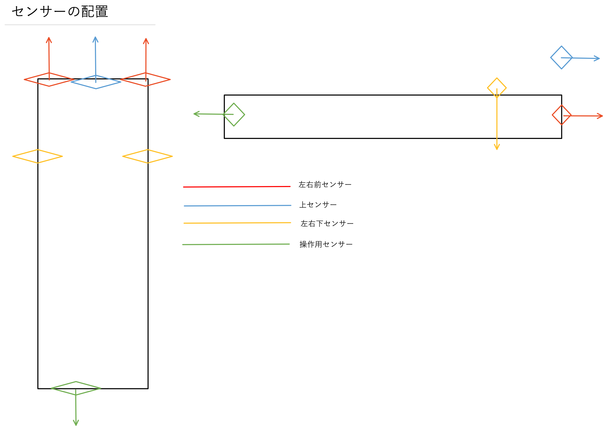

# DambaのRasberry Piについて
## GitHub使い方
    1.説明書  
        ここに書いてあるもの(README.md)です。  
    2.上のそれぞれのファイル  
        ファイル名をクリックするとファイルに書いてあることが見ることができます。  
        .pngだと画像が、.pyだとシステムコードが、.txtだと説明書などが見ることができます。  
    3.History  
        12/29からですが変更履歴が残っています。  
        変更の名前をクリックするとどこがいつどのように変更されたかがわかります。  
        名前はテキトウにつけてあります。(aとか1とか)  


## GitHub説明
    上のファイル(Dambaシステムの説明)(pep8には準じていないです。)
        circuit_diagram  
            回路図(感覚的に書きました。)  
        main.py  
            自律式稼動プログラム  
        manual.py  
            手動でDambaを操作するプログラム  
        sensor.py  
            センサーのテスト用プログラム  
        log_damba.py  
            /pi/dammemoに.txtで時間ごとに年月日_時のファイルを作り、  
            月日_時分秒ごとで様々なログを記録していく関数が書いてあるプログラム。
            上書きタイプ  
        ultrasonic_sensor_
            センサーの計測用のプログラム。
            片方から超音波を出して反対のセンサーに超音波が帰ってくるまでの時間を
            計測してそこから距離を計算して出している。
            データーシートでは4.5mぐらいまで計測できるようにしてあるが、
            念のため3m以上はエラーになるようにした。
        その他  
            部品とかテストとかいろいろ  
    以下ラズパイのソフトウェア関係のメモや説明など  

## circuit_diagram


## sensor_placement



## やること
### ソフトウェア
    OK
### ハードウェア
    OK


## 自動化(`main.py`の説明)
### play(threadingでコントローラーと同時進行(setDaemonはTrue))(def)
    前進  
    上、右、左、右下、左下の距離を計測  
        壁検知(壁or上り階段)(右or左が検知)  
        上にものがあるか  
            ない(上り階段)  
                左右のセンサーの距離の違いを計測  
                    左右の回転  
                    左右の距離の違いがなくなるまで回転  
                    階段に対して垂直に  
                        登る（前進)  
            ある(壁)  
                左右のセンサーの距離の違いで自分と壁の立ち位置を確認
                (左右どちらが前に出ているかを確認)  
                    周りやすい方に回転  
                    前進  
        下に床がない(左右でどちらかの距離が伸びる)(下り階段)
        (詳しくは下のDAMBAの問題点/解決したい/1.)  
            左右どちらが距離がのびたか確認(左右どちらの床がないか)(A)  
                右の床がない  
                    左の床がなくなるまで右折  
                        後退  
                        左、右の順番で床を検知  
                        それぞれの時間の差を計測(B)  
                            前進
                            片方だけ床を検知する(今回だと左)
                            （A)に戻る
                左の床がない
                    右と逆
            (B)が所定の時間より短いと
                垂直になったので降る
    階段を降りてる最中は前進のみ
        一定の回数床を検知したら階段通過完了を検知
### controller(def)
    センサー6の一定の距離以内にものがきたら自動化システム起動
        3秒後再度計測開始
        センサー6の一定の距離以内にものがきたら
            PINをoff
            一応cleanup(tryなのでできなくても問題なし)
            osのシャットダウン
### no_controllet(def)
    無条件でplayを起動


## マニュアル操作(`manual.py`の説明)
### manual(def)
    order->に入力
        1
            秒数を入力
            指定の秒数を前進
        2
            秒数を入力
            指定の秒数を後退
        3
            秒数を入力
            指定の秒数を右折
        4
            秒数を入力
            指定の秒数を左折
        5
            秒数を入力
            指定の秒数を腕の回転
        6
            秒数を入力
            指定の秒数を腕の逆回転
        11
            秒数を入力
            指定の秒数を右キャタピラのみ回転
        12
            秒数を入力
            指定の秒数を右キャタピラのみ逆回転
        21
            秒数を入力
            指定の秒数を左キャタピラのみ回転
        22
            秒数を入力
            指定の秒数を左キャタピラのみ逆回転
        30
            秒数を入力
            指定の秒数を腕の回転
        55
            秒数を入力
            指定の秒数を腕の回転、前進
        0
            GPIOを`cleanup`
        110
            1~6のGPIOを`False`


## センサーテスト(`sensor.py`の説明)
### manual(def)
    order->に入力
        1
            1のセンサーを起動
        2
            2のセンサーを起動
        3
            3のセンサーを起動
        4
            4のセンサーを起動
        5
            5のセンサーを起動
        6
            6のセンサーを起動
        7
            7のセンサーを起動
        0
            GPIOをcleanup(多分エラー)


## パラメータ
```python:main
#左キャタピラ
motor1_pin = 17 #前進
motor2_pin = 27 #後退

#右キャタピラ
motor3_pin = 24 #前進
motor4_pin = 23 #後退

#基本パラメータ
setting = 0 #ステータス
stairs = 0 #階段上
flag = False #mainのループ
stairs_time = 5 #階段から床への判断回数

setting_distance = 2 #稼働までの距離センサー１

#壁の対処パラメータ
out_distance = 10 #壁を検知する距離(cm)
go_back_time = 5 #壁に当たってから後退する時間(s)
turn_time = 10 #壁に当たった時の回避するための回転時間(s)左折
turn_time2 = 20 #壁に当たった時の回避するための回転時間(s)右折
wall_distance = 25 #壁か階段の距離(cm)(上の距離)(小さければ壁、大きければ階段)

#階段上り
step_turn_time = 2 #階段の回転(s)
difference_distance = 0.5 #右前と前の許容差
wall_d_distance = 3 #左右の調整時に近づきすぎの距離
back_wall_time = 3 #近づきすぎた時の後退時間

#階段下り
under_out_distance = 10 #下の距離がどのくらい空いたらダメか、床と階段の判断の距離
dis_dis_time = 0.5 #降るときの後退時の左右のセンサの時間の差
```


## ピン系メモ
### モータードライバ腕
    1->GPIO 5 
    2->GPIO 6 
    3->モータ
    4->GND
    5->モータ
    6->なし
    7->電池ボックス
### モータードライバ左キャタピラ
    1->GPIO 24
    2->GPIO 24
    3->モータ
    4->GND
    5->モータ
    6->なし
    7->電池ボックス
### モータードライバ右キャタピラ
    1->GPIO 17
    2->GPIO 27
    3->モータ
    4->GND
    5->モータ
    6->なし
    7->電池ボックス
### 超音波センサー1前
    1->5V(ラズパイ)
    2->GPIO 14(trig)
    3->GPIO 15(echo)
    4->GND
### 超音波センサー2右下(右)
    1->5V(ラズパイ)
    2->GPIO 25(trig)
    3->GPIO ８(echo)
    4->GND
### 超音波センサー3右前
    1->5V(ラズパイ)
    2->GPIO  7(trig)
    3->GPIO  1(echo)
    4->GND
### 超音波センサー4左下(左)
    1->5V(ラズパイ)
    2->GPIO 12(trig)
    3->GPIO 16(echo)
    4->GND
### 超音波センサー5左前
    1->5V(ラズパイ)
    2->GPIO 20(trig)
    3->GPIO 21(echo)
    4->GND
### 超音波センサー6UI
    1->5V(ラズパイ)
    2->GPIO 19(trig)
    3->GPIO 26(echo)
    4->GND
### 超音波センサー7下(壊れた)
    1->5V(ラズパイ)
    2->GPIO 9(trig)
    3->GPIO 11(echo)
    4->GND
### LED(なし)
    1->GPIO 10 長い方
    2->GND　短い方


## ラズパイメモ
    RPI.GPIO
        output->  1  GPIO.HIGH   True
    ラズパイライト
        赤のみ→起動してない
        赤と緑→起動してる(緑：何かのファイルをmicroSDに書き込んでる)


## DAMBAの課題点
### 解決したい
    1.下階段の判定が無理（解決済み）
        原因
            右左折の速度が違う
        解決策
            速度に依存しない方法で下階段を判定する
            1.1左に傾く
                右の下がなくなったら止まって、
                回る、
                左も下がなくなったら止まる、
                後退(A)、
                右と左の下が床になったら止まる、
                右の下がなくなるまで前進、
                回る、
                左の下がなくなったら止まる、
                (A)に戻る、
                右と左の床になる時間の差が短くなったら垂直、
                前進
            1.2右に傾く
                1.1のそれぞれ逆
            1.3垂直で階段に入った時
                距離更新時、両方とも下にない状態になったら前進
    2.階段を登れない
        原因
            トルク？そもそもある程度腕を曲げて登るのが無理？
        解決策
            電池増やす？←通常の前進で車両が外れるかも、重くなって登れないかも
            腕を上げながら前進？←上げた後下げれないかも
    3.前進ができる時できない時がある
        原因
            モーターの空回り？どこか引っかかってる？
            モーターが回ってる音はする
        解決策
            ギアボックスの改良
    4.PC無しで起動できない（解決済み）
        原因
            起動時にシステムが動かせない
            UIがまだない
        解決策
            起動時のシステムは外部に聞く
            UIは余ったセンサーでどうにかする
            ラズパイのライトをいじって状態の確認？できそうだけどできるかわからない
            ターミナルでcrontab -eで最後に
            @reboot Python3 /home/pi/damba/rasberry_pi/main.py
            に追加して上書き保存(コントロール+XでY)
            crontab -lで保存できているか確認できる
    5.右左折の回転速度が違う
        原因
            なんか引っかかってる？車体を浮かすと早い
        解決策
            左右で回る時間を変える
    6.右左折するとゴムがたくさん取れる
        解決策
            ゴムを何かで止める
    7.上階段の時、垂直にする段階で右左折で壁に当たるかも（解決済み）
        解決策
            ある一定の距離より近くなれば交代する
    8.ログ（解決済み）
        解決策
            .txtで記入していく


## 解決できない課題点（パワポ用）
    1.端っこまで掃除できない
        予算と時間がない
        掃除方法を変更することや機体の形状を帰ることにより対応可能
    2.上階段のセンサーが折れそう
        予算がない
        壁か上階段を判断する時にセンサーを伸び縮みさせる
    3.外観
        予算がない
        フレームとかを3Dプリンターで作れるといい
    4.ジャンパー線とかフレットボード系がぐちゃぐちゃ
        予算と時間がない
        それ用の基盤を作れたらかなり綺麗になる
    5.中途半端な隙間が有れば、上階段と壁の判断ができない
        上階段用のセンサーを増やしてさまざまな段差に対応

S.H
